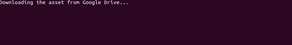

# IAssetCache

### Description

This repository contains the solution of the task for [internship](https://internship.jetbrains.com/projects/607/) from JetBrains.

### Run

On ubuntu:
```
git clone https://github.com/DarkFlink/Unity-Asset-Cache.git
cd ./Unity-Asset-Cache
dotnet build
```

Run for [default sample](https://drive.google.com/open?id=1zLV8MmwiXazvpv-6LMWNbuewPabzBFD9) (~170mb) from google drive:
```
./bin/Debug/netcoreapp3.1/IAssetCache_JB
```

Run for another sample:
```
./bin/Debug/netcoreapp3.1/IAssetCache_JB -p ./relative/path/to/your/.unity/asset
```

### Demonstration

##### Testing Build(...) and Merge(...) methods

The main problem here - dealing with interruptions and unexpected changes in file between interruptions.

If there is no changes between interruptions - program will continue the uploading. It provides **NOT to lose progress** in this  case:



If chages happened - the progress resets and uploading begins from the start:


##### Testing the API

After **successful completion** of Build and Merge methods you are available to use API.

GetLocalAnchorUsages(...) method:


GetGuidUsages(...) method:


GetComponentsFor(...) method:


**Note:** all tests here were launched on [default sample](https://drive.google.com/open?id=1zLV8MmwiXazvpv-6LMWNbuewPabzBFD9) from the original task.


